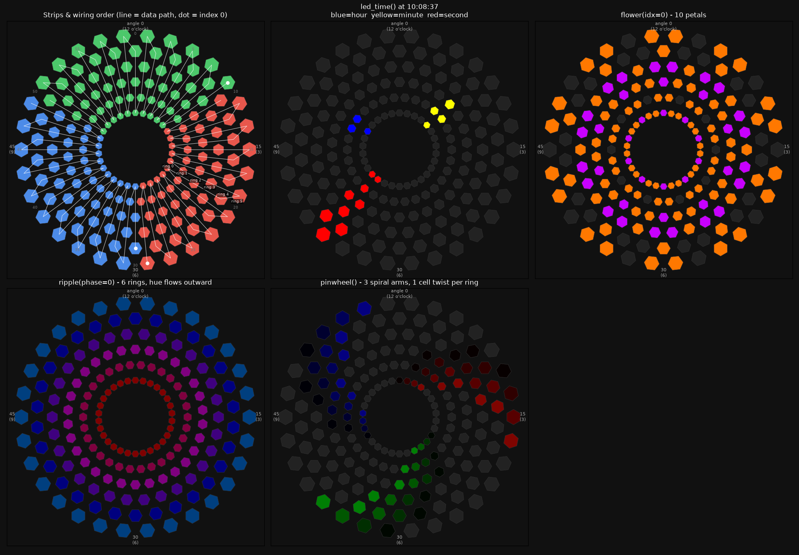

# Lotus
Lotus is a 3D-Printed Wall Art installation, for which more details can be found [on Printables](https://www.printables.com/model/588509-lotus-3d-led-wall-art).

This is the code repo for the MicroPython code that the installation runs, which I flashed using [Thonny](https://thonny.org/) to a Raspberry Pi Pico W (for control over WiFi).

## Arrangement/Config
This code assumes the Lotus is wired in 3 segments, corresponding to the left, right, and top 1/3rds of the installation. 
I wired the data lines for these segments to GPIO pins 15, 16, and 17 of the Pico W; see lines ~18-20 of `led.py` for this initialization. 
These assume a certain direction for the data lines depending on the segment; see the `set_led` method in `led.py` if you wish to change this.

The columns are staggered radially (even angles inset, odd angles outset), so the 60 columns x 3 LEDs read as 6 visual rings of 30. `tools/render_layout.py` draws the layout and a couple of patterns from the real `led.py` code:

The webserver accepts a few specific HTTP requests for control and reporting (I have my installation hooked up to Home Assistant for automations):

    - `GET /` : Report the current pattern via json: `{"pattern": "pattern_name"}` (`"connecting"` until WiFi is up)
    - `POST /pattern_name`: Sets the current pattern to `pattern_name`
    - `POST /`: Same as above, but POST body is json in the form: `{"pattern": "pattern_name"}`

## Patterns:
    - "off"
    - "clock"
    - "random"
    - "sweep"
    - "radial"
    - "bounce"
    - "simple_bounce"
    - "flower"
    - "ripple"
    - "pinwheel"

## Development
The code only runs on the Pico W, but the LED coordinate math and HTTP parsing are unit-tested on desktop Python using [uv](https://docs.astral.sh/uv/):

    uv run pytest

To preview the layout or a pattern without flashing:

    uv run --group render tools/render_layout.py

`stubs/` contains desktop stand-ins for the MicroPython-only modules so `led.py` and `main.py` import cleanly. Don't copy `stubs/` to the device.

To flash from the terminal instead of Thonny, install [mpremote](https://docs.micropython.org/en/latest/reference/mpremote.html) (`uv tool install mpremote`) and run:

    mpremote cp main.py led.py secrets.py :
